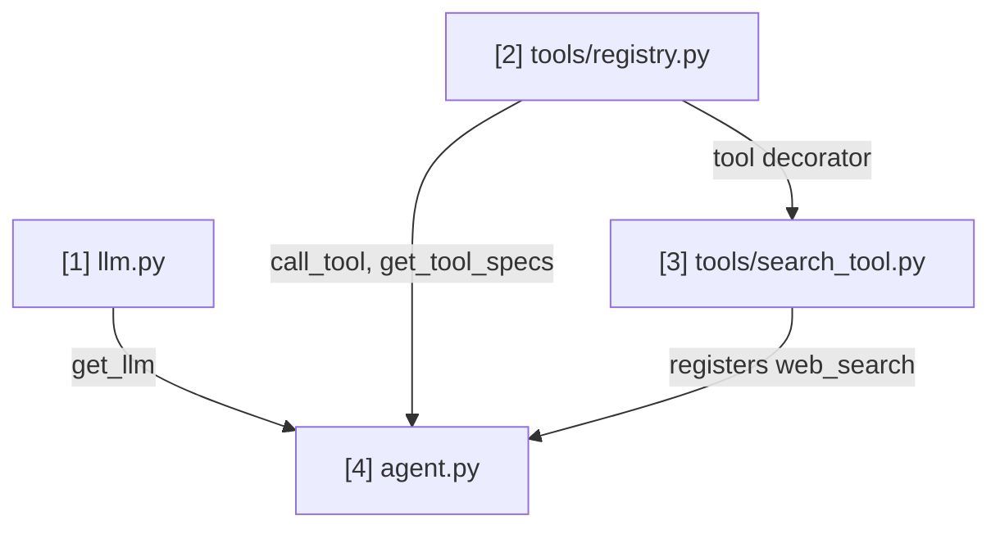

# tools — Notes & Timeline

Short, plain notes on every file created, in the order it was created, plus two
graphs so the project's history and structure are visible at a glance.

## Timeline

Every file with real content or behavior, in strict creation order (includes
`.gitignore`, README, config files — everything except empty/near-empty
`__init__.py` package markers, which are pure Python plumbing with nothing to
study and are omitted here — no Timeline node, no File notes entry). Each
node is numbered by creation order.

```
[1] .gitignore
     |
     v
[2] README.md
     |
     v
[3] requirements.txt
     |
     v
[4] .env.example
     |
     v
[5] llm.py
     |
     v
[6] tools/registry.py
     |
     v
[7] tools/search_tool.py
     |
     v
[8] agent.py
```

This completes the first slice of the build (search tool + agent loop).
Future tools each become the next node.

## Routes Graph (import / dependency connections)

This is ONE single graph covering the whole project — never split into
multiple smaller diagrams scattered through this file. It is different from
the Timeline above: the Timeline shows every file with real content in
creation order, while the Routes Graph only shows files that actually contain
import-relevant logic — skip `.gitignore`, `.env`/config files, READMEs,
dependency manifests, and any `__init__.py` package-marker file — even one
that imports submodules for side effects (e.g. table registration), since
that's plumbing, not something a reader needs to trace to understand
file-to-file data flow.
Every arrow means "the file at the tail is imported by the file at the head,"
labeled with *what* it imports.

**The number in each node's label is its own sequence number within THIS
graph only — it does NOT match the Timeline number for the same file.**
`llm.py` is Timeline `[5]` but Routes Graph node `1`. `tools/registry.py` is
Timeline `[6]` but Routes Graph node `2` — and it does NOT import `llm.py`
(the dependency runs the other way: `agent.py` will import both and wire
them together), so there's no edge between them yet. `tools/search_tool.py`
is Timeline `[7]` but Routes Graph node `3`, and it DOES import from node 2
(`tool` from `tools/registry.py`). `agent.py` is Timeline `[8]` but Routes
Graph node `4` — it imports from node 1 (`get_llm` from `llm.py`), node 2
(`call_tool`, `get_tool_specs` from `tools/registry.py`), and node 3
(`tools/search_tool.py`, imported for its registration side effect).
(`.gitignore`, `README.md`, `requirements.txt`, `.env.example`, and
`tools/__init__.py` are all excluded from this graph by the rule above.)

**This is a Mermaid diagram** (` ```mermaid `, `graph TD`) — GitHub and VS
Code render it automatically as an actual flowchart with boxes and arrows,
not raw text; hand-drawn ASCII arrows do not scale past a handful of nodes
and should not be used here. It is a living document: when a new file joins
the import graph, add its node and edges to this SAME diagram in place — do
not create a second Routes Graph elsewhere in this file, and do not leave
old now-superseded versions behind. Label each edge with what it imports
(e.g. `n2 -->|get_db| n6`) — this makes a separate connections list
unnecessary, since the labels carry that information directly.



## File notes

No analogies here — plain, factual logic and motive only (analogies belong in
chat and in CLAUDE.md, not here).

### [1] .gitignore
- Motive: Keep the virtual environment, caches, and secret-bearing `.env`
  files out of version control from the very first commit, since this repo
  is public.
- Logic: Standard Python ignore patterns (`.venv/`, `__pycache__/`, build
  artifacts, IDE/OS files) plus `.env`/`.env.*` with explicit exceptions for
  `.env.example`/`.env.sample` so placeholder config can still be tracked.

### [2] README.md
- Motive: Give the public repo a landing page stating what it is, since an
  empty repo with no description is unusable to a future visitor (including
  future-self).
- Logic: Title, one-paragraph description, a status note that it's early
  stage with no runnable code yet, and a placeholder Getting Started section
  to be filled in once real commands exist.

### [3] requirements.txt
- Motive: Reserve the standard place Python dependencies get declared, so
  every later lesson has one obvious file to add its new dependency to.
- Logic: Empty aside from a header comment; no dependencies chosen yet since
  no code exists.

### [4] .env.example
- Motive: Document which environment variables the project reads without
  ever committing real values, since the repo is public.
- Logic: Lists the four variables `llm.py` reads (model ID, region, AWS
  profile, temperature) with placeholder or safe default values.

### [5] llm.py
- Motive: Give every future file (tools, the agent loop) one shared way to
  call the LLM, instead of each one setting up its own Bedrock client.
  Rewritten from an earlier LangChain-based version to call Bedrock directly,
  so the raw request/response shape — including where tool definitions plug
  in — is visible rather than hidden behind a framework.
- Logic: Reads config from environment variables, builds a `boto3` session
  scoped to a named AWS SSO profile, and creates a `bedrock-runtime` client
  from it. `get_llm()` returns a `BedrockLLM` object whose `.invoke(messages,
  tools=None)` method builds a Bedrock Converse API request (nesting `tools`
  under `toolConfig` when provided) and returns the raw, unfiltered response
  dict — parsing/filtering that response is left to whatever calls it.

### [6] tools/registry.py
- Motive: Give every tool file one shared, consistent way to (a) describe
  itself to the LLM and (b) get found and executed when the LLM asks for it
  by name, instead of each tool file inventing its own bookkeeping.
- Logic: Two module-level collections — a list of Bedrock `toolSpec` dicts
  and a dict mapping tool name to Python function. The `@tool(name,
  description, input_schema)` decorator appends to both when applied to a
  function. `get_tool_specs()` returns the spec list for `llm.invoke(...,
  tools=...)`. `call_tool(name, arguments)` looks up the function by name and
  `await`s it with `**arguments`, raising `ValueError` if the name is
  unknown. (Revised after initial write: `call_tool` is `async def`, since
  every registered tool function must itself be `async def`.)

### [7] tools/search_tool.py
- Motive: Provide the first real tool capability — letting the LLM look up
  current information from the web — built on the registration pattern from
  `tools/registry.py`.
- Logic: Defines `async def web_search(query: str)`, decorated with
  `@tool(...)` carrying a hand-written JSON-schema description of its one
  `query` parameter. The function reads `TAVILY_API_KEY` from the
  environment, sends an `async` `POST` to Tavily's REST API
  (`https://api.tavily.com/search`) via `httpx.AsyncClient` with a `Bearer`
  auth header, and formats the returned results (title, URL, content
  snippet) into one numbered plain-text string. (Revised after initial
  write: switched from sync `requests` to async `httpx` so every tool
  function can be `async def`.)

### [8] agent.py
- Motive: Drive an actual conversation between the LLM and the tools —
  sending a question, noticing when Bedrock wants a tool, running it, and
  getting a final answer. This is the file that makes the earlier three
  files do something observable.
- Logic: `run(question)` builds a `messages` list in Bedrock's wire format
  and calls `llm.invoke(messages, tools=get_tool_specs())`. If the
  response's `stopReason` is `"tool_use"`, it collects every `toolUse` block
  from the reply, runs them concurrently with `asyncio.gather` (via
  `call_tool`), packages each result into a `toolResult` block tagged with
  its `toolUseId`, sends one more `invoke()` call with those results
  appended, and returns the resulting text. Handles exactly one round of
  tool calls (not a general loop) by explicit design choice — a model
  chaining a second round of tool calls after seeing the first result is
  not currently handled. `main()` reads a question from the terminal and
  runs everything via `asyncio.run()`.
